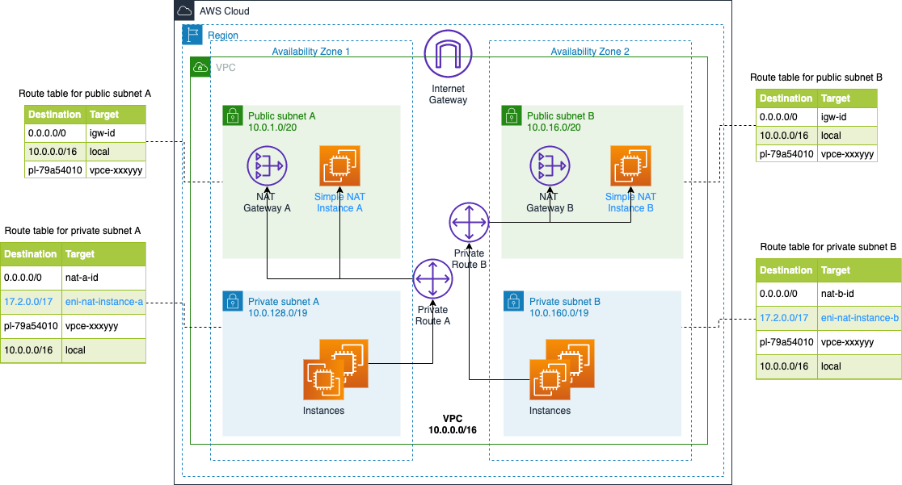

# Simple NAT


[](https://www.npmjs.com/package/cdk-construct-simple-nat)
[](https://pypi.org/project/zxkane.cdk-construct-simple-nat/)

It's a CDK construct to create NAT instances on AWS. 

It supports adding specific IP CIDRs to route tables of VPC, the network traffic to those IP CIDRs will be forwarded to the NAT instances.

It supports routing to below services out of box,

- Github git servers
- Google
- Cloudflare



## Install
TypeScript/JavaScript:

```shell
yarn add cdk-construct-simple-nat
```

or

```shell
npm install cdk-construct-simple-nat
```

## Usage

```ts
import { SimpleNAT } from 'cdk-construct-simple-nat';

new SimpleNAT(this, 'SimpleNAT', {
  vpc,
  natSubnetsSelection: {
    subnetType: SubnetType.PUBLIC,
    onePerAz: true,
  },
})
.withGithubRoute();
```

See the complete [example](example/) and [API doc][api-doc].

## FAQ
### What's the difference between [EC2 NAT instances][nat-instances] and NAT instances created by this construct

There are below differences,

- EC2 NAT instance will route all Internet traffic to itself by default
- NAT instance uses depracated Amazon Linux AMI, this construct always uses latest Amazon Linux 2 AMI
- NAT instances created by this construct can work with NAT gateways together, you can have multiple NAT instances in one VPC
- This construct can help when only routing specific traffic(for example, github/gist) to NAT instances which acts as transit proxy 

### What's the difference between [CDK built-in NAT instances][cdk-ec2-nat-instances] and NAT instances created by this construct

- CDK built-in NAT instances has to be created with VPC stack, this construct can add NAT instances to any existing VPC
- You can use this construct multiple NAT instances for different purposes
- This construct allows you customize the instances how to route the traffic

### The deployment fails due to the routes in route table exceeds the limit

[The default routes in route table is 50][vpc-limits-route-tables], the deployment will fail if adding routes more than the limit of your account. 
You can increase the limit up to **1000** routes per route table via service quota.

### How to exclude IPv6 CIDR with built-in github/google/cloudflare routes

You can exclude IPv6 CIDR like below,

```ts
new SimpleNAT(this, 'SimpleNAT', {
  vpc,
})
.withCloudflareRoute({
  excludeIPv6: true,
});
```

[nat-instances]: https://docs.aws.amazon.com/cdk/api/latest/docs/aws-ec2-readme.html#using-nat-instances
[cdk-ec2-nat-instances]: https://docs.aws.amazon.com/cdk/api/latest/docs/aws-ec2-readme.html#using-nat-instances
[api-doc]: ./API.md
[vpc-limits-route-tables]: https://docs.aws.amazon.com/vpc/latest/userguide/amazon-vpc-limits.html#vpc-limits-route-tables